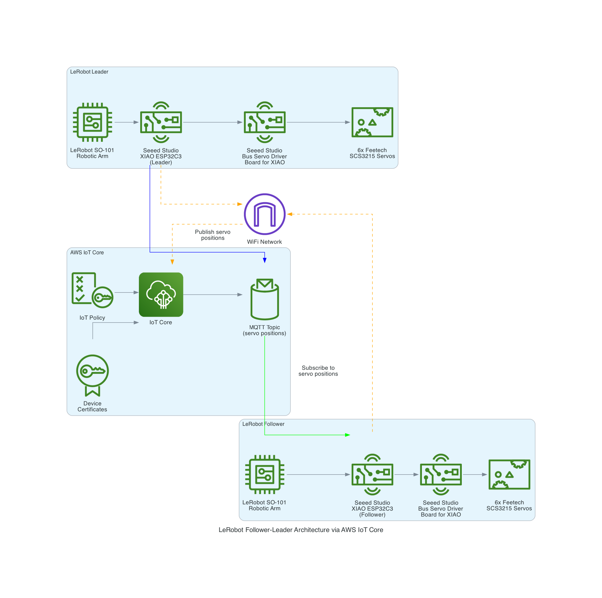

# Controlling LeRobot SO-101 Arms using AWS IoT and  MicroPython on a Seeed Studio ESP32C3

This repository contains the MicroPython code for controlling a set of LeRobot SO101 robotic arms using Seeed Studio XIAO ESP32-C3 micro-controllers over AWS IoT Core; this is the code for the demo I did during my talk at the AWS Community Day 2025 talk in Aotearoa New Zealand. The implementation supports both leader and follower arm configurations for teleoperation scenarios over the internet.

## 🤖 Project Overview

The LeRobot SO101 is a 6-DOF robotic arm that can be configured as:
- **Leader Arm**: Reads servo positions and publishes them as MQTT messages to an AWS IoT Core Topic
- **Follower Arm**: Receives the MQTT messages from AWS IoT Core Topic sent by the Leader Arm
- The **Follower Arm** follows the movement of the **Leader Arm**
- Without a computer such as Raspberry PI
- Controlled over the internet


## 🏗️ System Architecture



### Data Flow
1. **Leader Arm**: Manual manipulation → Servo position reading → ESP32-C3 → WiFi Network → AWS IoT Core
2. **AWS IoT Core**: MQTT message routing with device authentication and IoT policies
3. **Follower Arm**: AWS IoT Core → WiFi Network → ESP32-C3 → Servo position commands → Physical movement

### Key Components
- **LeRobot SO-101**: 6-DOF robotic arms (Leader and Follower)
- **Seeed Studio XIAO ESP32-C3**: WiFi-enabled microcontrollers for both arms
- **Bus Servo Driver Board**: Interface for controlling Feetech SCS3215 servos
- **AWS IoT Core**: Secure cloud messaging with device certificates and policies
- **MQTT Topics**: Real-time servo position data exchange

### Communication Features
- **Secure Authentication**: X.509 certificates for device identity verification
- **Bidirectional Messaging**: Leader publishes positions, Follower subscribes and executes
- **Network Resilience**: Automatic reconnection and error recovery mechanisms

## 📋 Hardware Requirements

### Required Components

#### Core Hardware
- **[SO-ARM100 Low Cost AI Arm Kit Pro](https://www.seeedstudio.com/SO-ARM100-Low-Cost-AI-Arm-Kit-Pro-p-6343.html)** (x2 - one for leader, one for follower)
  - **Complete kit includes:**
    - 3D-printed robotic arm frame and all mechanical parts
    - 6x Feetech SCS3215 digital servos (pre-configured)
    - XIAO ESP32-C3 development board
    - Bus Servo Driver Board for XIAO
    - All necessary cables and connectors
    - Assembly hardware and mounting components
  - Open-source design for DIY robotics projects
  - Ready-to-assemble complete solution
    
## 🚀 Quick Start Guide

### Step 1: Hardware Assembly

#### 1.1 Assemble the SO-ARM100 Robotic Arms
1. **Unbox two [SO-ARM100 kits](https://www.seeedstudio.com/SO-ARM100-Low-Cost-AI-Arm-Kit-Pro-p-6343.html)** - each contains all necessary components
2. **Follow the assembly guide** provided with each kit
3. **Assemble the mechanical frame** using the included 3D-printed parts
4. **Install the pre-configured servos** in their designated positions (servos should already have correct IDs 1-6)
5. **Mount the included Bus Servo Driver Board** on each robotic arm base
6. **Connect the included XIAO ESP32-C3** to each driver board
7. **Test mechanical assembly** before proceeding to software setup

#### 1.2 Optional Display Setup
1. **Connect the OLED Display** to each arm (Optional but recommended):
   - VCC → 3.3V
   - GND → GND
   - SDA → GPIO 6 (D4)
   - SCL → GPIO 7 (D5)

#### 1.3 Power and Final Connections
1. **Connect external power supply** (7.4V) to each driver board
2. **Verify all connections** - servo communication is handled automatically by the included driver boards
3. **Test both arms** - servos should initialize and hold position when powered

### Step 2: Install MicroPython

1. **Download MicroPython firmware** for ESP32-C3:
   ```bash
   wget https://micropython.org/download/esp32c3-usb/esp32c3-usb-20240222-v1.22.2.bin
   ```

2. **Flash MicroPython** to the ESP32-C3:
   ```bash
   # Install esptool if not already installed
   pip install esptool

   # Erase flash
   esptool.py --chip esp32c3 --port /dev/ttyACM0 erase_flash

   # Flash MicroPython (adjust port as needed)
   esptool.py --chip esp32c3 --port /dev/ttyACM0 write_flash -z 0x0 esp32c3-usb-20240222-v1.22.2.bin
   ```

3. **Install required MicroPython libraries**:
   ```bash
   # Connect to MicroPython REPL
   # Install umqtt.simple library
   import upip
   upip.install('micropython-umqtt.simple')
   ```

### Step 3: Configure WiFi

1. **Edit `config_wifi.py`**:
   ```python
   WIFI_NAME = b'YOUR_WIFI_NETWORK_NAME'
   WIFI_PASSWORD = b'YOUR_WIFI_PASSWORD'
   ```

### Step 4: AWS IoT Core Setup

⚠️ **Important**: The certificates included in this repository are **no longer active** and are provided for reference only to demonstrate the setup process.

#### Setting Up Your Own AWS IoT Core

1. **Create AWS IoT Things** in AWS Console:
   - Leader: `XIAOLerobotArmLeaderAWS`
   - Follower: `XIAOLerobotArmFollowerAWS`

2. **Generate certificates** for each device:
   - Device certificate (cert.pem)
   - Private key (private.key)
   - Root CA certificate

3. **Convert certificates to DER format**:
   ```bash
   # Convert certificate
   openssl x509 -outform DER -in cert.pem -out cert.der

   # Convert private key
   openssl rsa -outform DER -in private.key -out key.der
   ```

4. **Update configuration files**:
   - Edit `config/XIAOLerobotArmLeaderAWS/config_aws.py`
   - Edit `config/XIAOLerobotArmFollowerAWS/config_aws.py`
   - Replace with your AWS IoT endpoint and thing names

5. **Create IoT policies** with appropriate permissions:
   ```json
   {
     "Version": "2012-10-17",
     "Statement": [
       {
         "Effect": "Allow",
         "Action": [
           "iot:Connect",
           "iot:Publish",
           "iot:Subscribe",
           "iot:Receive"
         ],
         "Resource": "*"
       }
     ]
   }
   ```

### Step 5: Upload Files to ESP32-C3

Upload the following files to your ESP32-C3:

**For Leader Arm:**
- `lerobot-leader-aws.py` (rename to `main.py`)
- `config_wifi.py`
- `ssd1306.py`
- `config/XIAOLerobotArmLeaderAWS/` (entire folder)

**For Follower Arm:**
- `lerobot-follower-aws.py` (rename to `main.py`)
- `config_wifi.py`
- `ssd1306.py`
- `config/XIAOLerobotArmFollowerAWS/` (entire folder)

### Step 6: Testing

1. **Power on both devices**
2. **Check OLED display** for connection status
3. **Move the leader arm** manually (torque is disabled)
4. **Observe the follower arm** replicating movements
5. **Monitor AWS IoT Test console** for message flow

## 📁 File Structure

```
aws-iot-core-lerobot-so101/
├── README.md
├── lerobot-leader-aws.py          # Leader arm MicroPython code
├── lerobot-follower-aws.py        # Follower arm MicroPython code
├── config_wifi.py                 # WiFi configuration
├── ssd1306.py                     # OLED display driver
└── config/
    ├── XIAOLerobotArmLeaderAWS/
    │   ├── config_aws.py          # Leader AWS IoT configuration
    │   ├── cert.der               # Device certificate (INACTIVE - for reference)
    │   └── key.der                # Private key (INACTIVE - for reference)
    └── XIAOLerobotArmFollowerAWS/
        ├── config_aws.py          # Follower AWS IoT configuration
        ├── cert.der               # Device certificate (INACTIVE - for reference)
        └── key.der                # Private key (INACTIVE - for reference)
```

## 🔧 Code Architecture

### Leader Arm (`lerobot-leader-aws.py`)
- **Disables servo torque** for manual manipulation
- **Reads servo positions** at high frequency (100Hz)
- **Publishes position data** to AWS IoT Core topic
- **Includes reconnection logic** for network reliability

### Follower Arm (`lerobot-follower-aws.py`)
- **Subscribes to position commands** from AWS IoT Core
- **Executes servo movements** with minimal latency
- **Throttles updates** to prevent servo overload
- **Optimized for real-time performance**

### Communication Protocol
```json
{
  "device_name": "XIAOLerobotArmLeaderAWS",
  "servo_1_shoulder_pan": -45.2,
  "servo_2_shoulder_lift": 30.1,
  "servo_3_elbow_flex": -60.5,
  "servo_4_wrist_flex": 15.0,
  "servo_5_wrist_roll": 90.0,
  "servo_6_gripper": -30.0
}
```

## ⚙️ Configuration Details

### AWS IoT Topics
- **Leader publishes to**: `the-project/robotic/XIAOLerobotArmLeaderAWS/state`
- **Follower subscribes to**: `the-project/robotic/XIAOLerobotArmLeaderAWS/state`

### Performance Optimization
- **Leader**: Publishes only when servo angles change by >1°
- **Follower**: Processes updates at maximum 200Hz (5ms intervals)
- **Both**: Include MQTT keep-alive and reconnection logic

## 🛠️ Troubleshooting

### Common Issues

**Connection Problems:**
- Verify WiFi credentials in `config_wifi.py`
- Check AWS IoT endpoint and certificates
- Ensure certificates have proper permissions

**Servo Issues:**
- Verify UART connections (TX/RX pins)
- Check servo power supply (7.4V recommended)
- Ensure servo IDs are set correctly (1-6)

**Display Issues:**
- Verify I2C connections (SDA/SCL pins)
- Check I2C address (default: 0x3C)
- Display is optional - code works without it

### Debug Mode
Enable debug output by setting `SHOW_DEBUG = True` in the leader code to monitor:
- MQTT connection status
- Publish count and frequency
- Error messages and reconnection attempts

## 📝 License

This project is open source. Please ensure you comply with AWS IoT Core terms of service and any applicable hardware licenses.

## 🤝 Contributing

Contributions are welcome! Please feel free to submit issues, suggestions, or pull requests.

## ⚠️ Security Notice

- **Never commit real certificates or keys to public repositories**
- **Rotate certificates regularly**
- **Use least-privilege IAM policies** for IoT devices
- **Monitor AWS IoT usage** to detect anomalies

## 📞 Support

For issues related to:
- **Hardware**: Consult LeRobot SO101 and ESP32-C3 documentation
- **AWS IoT Core**: Check AWS IoT Developer Guide
- **MicroPython**: Visit MicroPython documentation

---

Built with ❤️ for the robotics community
